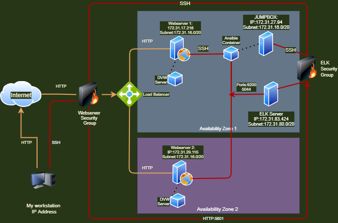
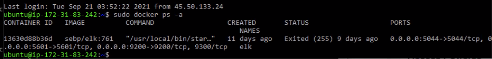

## Automated ELK Stack Deployment

The files in this repository were used to configure the network depicted below.

These files have been tested and used to generate a live ELK deployment on AWS. They can be used to either recreate the entire deployment pictured above. Alternatively, select portions of the `yaml` file may be used to install only certain pieces of it, such as Filebeat.

  - [elkplaybook.yml](Ansible/elkplaybook.yml)._

This document contains the following details:
- Description of the Topology
- Access Policies
- ELK Configuration
  - Beats in Use
  - Machines Being Monitored
- How to Use the Ansible Build

### Description of the Topology

The main purpose of this network is to expose a load-balanced and monitored instance of DVWA, the D*mn Vulnerable Web Application.

Load balancing ensures that the application will be highly available, in addition to restricting access to the network.
- The security aspects the Load Balancer protects are designed to distribute traffic equally between Webservers 1 and 2 located in seperate availability zones. This will ensure that in the event of a disaster or Denial of Service, access will continue.  
- The purpose and advantages of using the Jumpbox are that all administrative traffic must pass through the ELK Security Group firewall and be run through this gateway machine for making changes.
- Restrict access to the network and direct traffic to balance between webservers.  Jumpbox is used as a defense-in-depth measure to restrict access to the back-end of the webservers.

Integrating an ELK server allows the administrator to easily monitor the otherwise vulnerable VMs for changes to the configurations and system files.
Filebeat monitors: SSH logins, account logins, and sudo commands.
Metricbeat records: CPU, RAM and Network usage levels.

The configuration details of each machine may be found below.

| Name     | Function | IP Address | Operating System |
|----------|----------|------------|------------------|
| Jump Box | Gateway  | 172.31.27.94 | Linux            |
| Webserver-1     |  Web Server   |    172.31.17.216        |       Linux       |
| Webserver-2  | Web Server    |     172.31.29.115       |      Linux             |
| ELK-Ubuntu     | SIEM     |    172.31.83.242        |        Linux           |

### Access Policies

The machines on the internal network are not exposed to the public Internet.   Only the Webservers 1 and 2 (located in separate availability zones and load balanced) can be accessed by the public. 

Only the Jumpbox machine can accept connections from the Internet. Access to this machine is only allowed from the following IP addresses:
- The User of the jumpbox should only be accessible from my IP address.

Machines within the network can only be accessed by The Jumpbox.
- The Jumpbox  172.31.27.94 is the only machine allowed to access the ELK Server.

A summary of the access policies in place can be found in the table below.

| Name     | Publicly Accessible | Allowed IP Addresses |
|----------|---------------------|----------------------|
| Jump Box | NO                 | My IP address    |
|  Elk-Ubunto        |  NO                    |      172.31.27.94                |
|     Webserver1     |  Yes                   |     Public                 |
|     Webserver2     |  Yes                   |     Public                 |
### Elk Configuration

Ansible was used to automate configuration of the ELK machine. No configuration was performed manually, which is advantageous because of automating configuration with Ansible, it is less prone to human error, faster, and patch management among multiple machines is much easier

The playbook implements the following tasks:
- Install Elk
- Increase virtual memory
- Install pip
- Install Docker python module
- Download and launch a docker elk container

The following screenshot displays the result of running `docker ps` after successfully configuring the ELK instance.

### Target Machines & Beats
This ELK server is configured to monitor the following machines with filebeat and metric beat containers
- 172.31.17.216
- 172.31.29.115

We have installed the following Beats on these machines:
- Filebeat
- Metricbeat

These Beats allow us to collect the following information from each machine:
- Filebeat collects SSH logins, sudo commands, and account logins.  These can assist an administrator or security personel identify unauthorized access.
- Metricbeat collects cpu, ram, and network usage in order to monitor the health of the system and prevent a denial of service attack

### Using the Playbook
In order to use the playbook, you will need to have an Ansible control node already configured.   Some commands listed below can assist in the navigation and implemetation of these details

- sudo docker pull
{in order to download docker image}
- sudo docker ps 
 {lists active dockers on a machine}
- sudo docker container list -a
{displays all server on the server}
- ansible all -m ping
{ping all of the hosts}
- ansible docker-container 
{the docker-container module can be used to download and manage docker containers}  

### To Initiate Docker {include container name}

- sudo docker start {include container name}
{starts docker}
- sudo docker attach {input container name}
{attaches connection to docker}

Assuming you have such a control node provisioned: 

SSH into the control node and follow the steps below:
- Update the ansible.cfg file to include ELK server host information
- Run elkplaybook.yml 
- Copy the /filebeat-config.yml file to /etc/ansible/filebeat-config.yml.
- Update the `filebeat-config.yml` file to include the kibana host login url and elastic search host url.
- Run the playbooks, and navigate to `/etc/ansible folder` to check that the installation worked as expected.

- The playbook file is named `elkplaybook.yml` as well as additional playbooks and configuration files are located in /etc/ansible within the container
- Update the `hosts` file to create a `webserver` group and a `elk` server group in order to make ansible run the elkplaybook and filebeatplaybook properly on specific machines. 

- Navigate to the following URL in order to check that the ELK server is running. Kibana can be used to monitor and control various performance metrics.
- http://52.90.115.3:5601/:5601

-End
