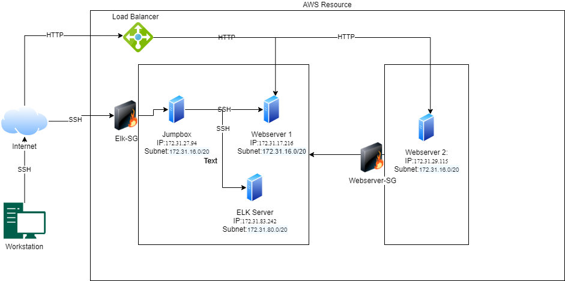

## Automated ELK Stack Deployment

The files in this repository were used to configure the network depicted below.

These files have been tested and used to generate a live ELK deployment on AWS. They can be used to either recreate the entire deployment pictured above. Alternatively, select portions of the `yaml` file may be used to install only certain pieces of it, such as Filebeat.

  - [ansibleplaybook.yml](Ansible/ansibleplaybook.yml)._

This document contains the following details:
- Description of the Topologu
- Access Policies
- ELK Configuration
  - Beats in Use
  - Machines Being Monitored
- How to Use the Ansible Build

### Description of the Topology

The main purpose of this network is to expose a load-balanced and monitored instance of DVWA, the D*mn Vulnerable Web Application.

Load balancing ensures that the application will be highly `available`, in addition to restricting access to the network.
- What aspect of security do load balancers protect? What is the advantage of a jump box? 
- Restrict access to the network and direct traffic to balance between webservers.  Jump box is used as a defense in depth measure to restrict access to the back-end of the webservers.

Integrating an ELK server allows users to easily monitor the vulnerable VMs for changes to the configurations and system files.
- What does Filebeat watch for? SSH logins, account logins, and sudo commands.
- What does Metricbeat record?  CPU, RAM and Network usage levels.

The configuration details of each machine may be found below.
_Note: Use the [Markdown Table Generator](http://www.tablesgenerator.com/markdown_tables) to add/remove values from the table_.

| Name     | Function | IP Address | Operating System |
|----------|----------|------------|------------------|
| Jump Box | Gateway  | 172.31.27.94 | Linux            |
| Webserver-1     |  Web Server   |    172.31.17.216        |       Linux       |
| Webserver-2  | Web Server    |     172.31.29.115       |      Linux             |
| ELK-Ubuntu     | SIEM     |    172.31.83.242        |        Linux           |

### Access Policies

The machines on the internal network are not exposed to the public Internet. 

Only the Jumpbox machine can accept connections from the Internet. Access to this machine is only allowed from the following IP addresses:
- My IP address  The User of the jumpbox should only be accessible from my IP address.

Machines within the network can only be accessed by The Jumpbox.
- Which machine did you allow to access your ELK VM? What was its IP address?  The Jumpbox  172.31.27.94

A summary of the access policies in place can be found in the table below.

| Name     | Publicly Accessible | Allowed IP Addresses |
|----------|---------------------|----------------------|
| Jump Box | Yes             | My IP address    |
|  Elk-Ubunto        |  NO                   |      172.31.27.94                |
|     Webserver1     |  Yes                   |     Public                 |
|     Webserver2    |  Yes                   |     Public                 |
### Elk Configuration

Ansible was used to automate configuration of the ELK machine. No configuration was performed manually, which is advantageous because...
- What is the main advantage of automating configuration with Ansible?  Less prone to human error, faster, and patch management is easier.

The playbook implements the following tasks:
- In 3-5 bullets, explain the steps of the ELK installation play. E.g., install Docker; download image; etc._
- Install Elk
- Increase virtual memory
- Install pip
- Install Docker python module
- Download and launch a docker elk container

The following screenshot displays the result of running `docker ps` after successfully configuring the ELK instance.

### Target Machines & Beats
This ELK server is configured to monitor the following machines:
- List the IP addresses of the machines you are monitoring_
- 172.31.17.216
- 172.31.29.115

We have installed the following Beats on these machines:
- Specify which Beats you successfully installed_
- Filebeat
- Metricbeat

These Beats allow us to collect the following information from each machine:
- In 1-2 sentences, explain what kind of data each beat collects, and provide 1 example of what you expect to see. E.g., `Winlogbeat` collects Windows logs, which we use to track user logon events, etc._
- Filebeat collects SSH logins, sudo commands, and account logins
- Metricbeat collects cpu, ram, and network usage

### Using the Playbook
In order to use the playbook, you will need to have an Ansible control node already configured. Assuming you have such a control node provisioned: 

SSH into the control node and follow the steps below:
- Copy the /filebeat-config.yml file to /etc/filebeat-config.yml.
- Update the `filebeat-config.yml` file to include the kibana host login url and elastic search host url.
- Run the playbook, and navigate to `/etc/ folder` to check that the installation worked as expected.

Answer the following questions to fill in the blanks:_
- Which file is the playbook? Where do you copy it? `ansibleplaybook.yml` - I copied it in the playbook folder in my ansible container.
-Which file do you update to make Ansible run the playbook on a specific machine? How do I specify which machine to install the ELK server on versus which to install Filebeat on?
  - I had to update the `hosts` file to create a `webserver` group and a `elk` server group.

- _Which URL do you navigate to in order to check that the ELK server is running?
- https://http://3.86.92.219:5601/
